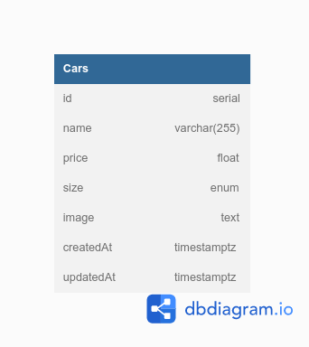

# Challange 5 SYNRGY 5 Binar x BCA

## Car Management API

## Library

<ul>
  <li>express</li>
  <li>pg pg-hoster</li>
  <li>multer</li>
  <li>cloudinary</li>
  <li>sequelize</li>
  <li>sequelize-cli</li>
</ul>

## Entity Relationship Diagram

---



## Enpoint

---

#### Get All Cars

<ul>
  <li>Example : Get cars by size <code>GEt /cars?size=small</code></li>
</ul>

```http
    GET /cars
```

#### Get By Id

```http
    GET /cars/:id
```

#### Create Cars

```http
    POST /cars
```

#### Update Cars

```http
    PUT /cars/:id
```

#### Delete Cars

```http
    DELETE /cars/:id
```

## Edit Config Database

---

<ul><li>File<code>config/config.json</code></li></ul>

```
{
  "development": {
    "username": "isi username",
    "password": "isi password",
    "database": "db_development",
    "host": "localhost",
    "dialect": "postgres"
  },
  "test": {
    "username": "isi username",
    "password": "isi password",
    "database": "db_test",
    "host": "localhost",
    "dialect": "postgres"
  },
  "production": {
    "username": "isi username",
    "password": "isi password",
    "database": "db_production",
    "host": "localhost",
    "dialect": "postgres"
  }
}
```

## Cloudinary

---

<ul><li>File<code>utils/cloudinary.js</code></li></ul>

```
    const cloudinary = require('cloudinary').v2;

    cloudinary.config({
    cloud_name: 'ISI_PUNYA_MASING2',
    api_key: 'ISI_PUNYA_MASING2',
    api_secret: 'ISI_PUNYA_MASING2',
    secure: true,
    });

    module.exports = cloudinary;

```
